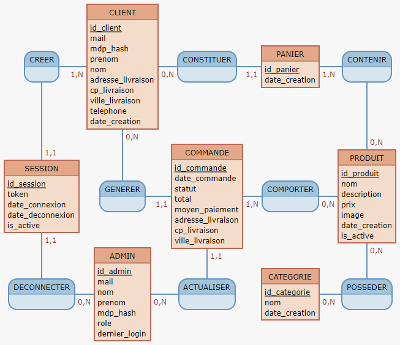

# Tables :

## Client:
id_client  
mail  
mdp_hash  
prenom  
nom  
adresse_livraison  
cp_livraison  
ville_livraison  
telephone  
date_creation  

## Session
id_session  
token  
date_connexion  
date_deconnexion  
is_active  

## Admin 
id_admin  
mail
nom
prenom  
mdp_hash  
role
dernier_login

## Produit
id_produit  
nom   
description  
prix  
image  
date_creation  
is_active  

## Catégorie
id_categorie
nom
date_creation

## Panier
id_panier  
date_creation

## Commande
id_commande
date_commande
statut
total
moyen_paiement
adresse_livraison
cp_livraison 
ville_livraison

 
 

# Lien vers Mocodo : 
https://www.mocodo.net/

## Texte pour générer le Mocodo: 
CREER, 1N CLIENT, 11 SESSION
CLIENT: id_client, mail, mdp_hash, prenom, nom, adresse_livraison, cp_livraison, ville_livraison, telephone, date_creation
CONSTITUER, 0N CLIENT, 11 PANIER
PANIER: id_panier, date_creation
CONTENIR, 1N PANIER, 0N PRODUIT

SESSION: id_session, token, date_connexion, date_deconnexion, is_active
GENERER, 0N CLIENT, 11 COMMANDE
COMMANDE: id_commande, date_commande, statut, total, moyen_paiement, adresse_livraison, cp_livraison, ville_livraison
COMPORTER, 1N COMMANDE, 0N PRODUIT
PRODUIT: id_produit, nom, description, prix, image, date_creation, is_active

DECONNECTER, 11 SESSION, 0N ADMIN
ADMIN: id_admin, mail, nom, prenom, mdp_hash, role, dernier_login
ACTUALISER, 0N ADMIN, 11 COMMANDE
CATEGORIE: id_categorie, nom, date_creation
POSSEDER, 0N CATEGORIE,  0N PRODUIT

## lien MOCODO: 

https://www.mocodo.net/?mcd=eNqVUs1ugzAMvucp8gAc1utuCKIq0hoQpGcUEau1BglK0qp7-0GADrpddnFiQ_z92FnFWJXQg6DZB2dCjtcDrVld80KQufROUTdth2BCQnuF3Rj10FyVvyZ0cGBsn9AYlHbgPTQd3p1Cb01C22Gb3bHrdp8DdDBcrYGEahWgaR2ogNaQrBC15PI8kXvbkStTwVlF5iNyG5RBcH90kEzwWdz8d2xVVkV-5pKQRWVs4UfeGAnZTzBrK2sMPGI55ho2FfSNagPegRyZYNVvnllxOqUiZ2S9zD7avldGP_U-Ux9UuIWJQFCTw_YLzKgMoY--_9faCbUsKrkOd-Gwc2A5Zw-d1TcMyyA1-NbhEKLSweFj1Nury-uUti6QnI2OC5bNkM8liohpfuKCxBjRlO7RrMsUEdc9-tksZ7sJD9w03KazFzQkzeQ5_eD14nZs-GJ2KtmxqPji9sj2Yh3Cqmu3IWVR1yxfJ7c-TOjWo2_JPQFF

## schéma généré par MOCODO: 

